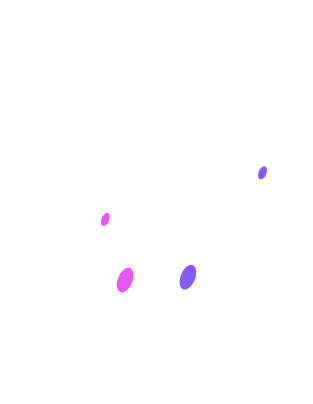
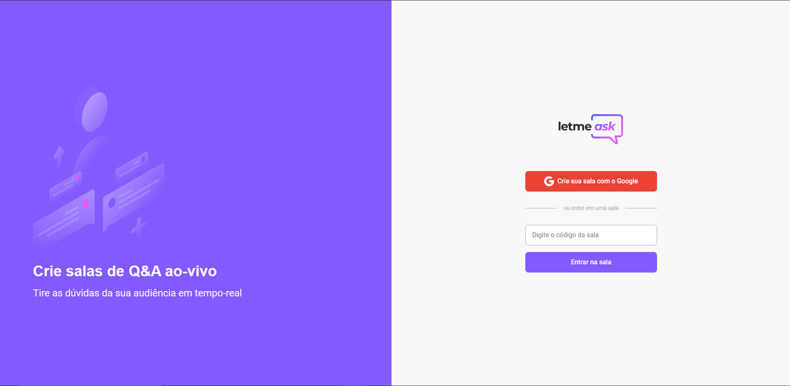
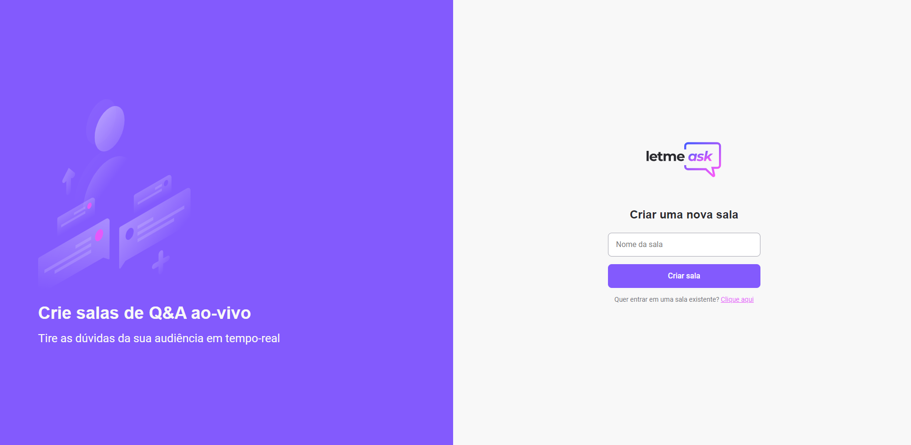
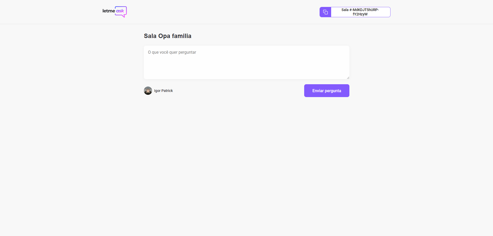
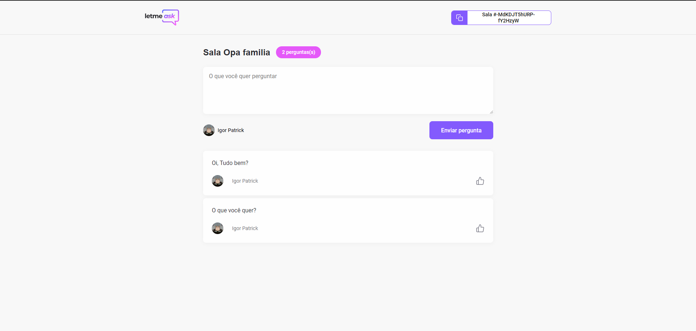
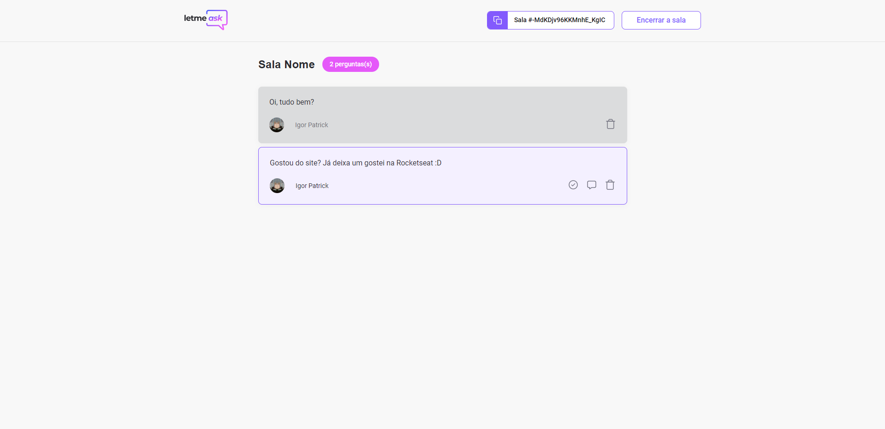

<blockquote>

Um aplicativo web da NLW together

</blockquote>

  

  

  
---

---
<h3 align=center> É um app de perguntas, onde o principal objetivo é mostrar as perguntas, as que estão sendo respondidadas no momento e as que já foram. </h3>

---

  
### Aqui é onde você cria a sala

  
### Aqui é a visão do visitante

  
### Aqui é as perguntas, onde você pode dar like nelas
  

### Aqui é a visão do host, onde pode deixar em dastaque, marcar como respondida ou apagar a pergunta
  

